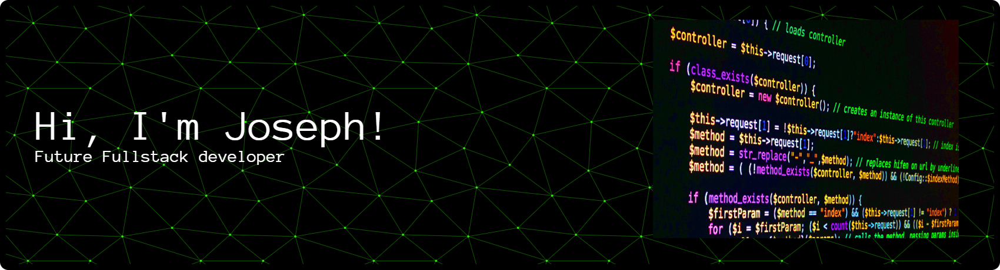

  

  
    📍 From Costa Rica • 🎂 22 years old • 📚 Currently learning and growing as a developer
  

---

<h3>🚧 Open source projects</h3>

Currently working on my first open source project. Stay tuned...

<table>
  <thead align="center">
    <tr>
      <td><b>🎁 Projects</b></td>
      <td><b>⭐ Stars</b></td>
      <td><b>📚 Forks</b></td>
      <td><b>🛎 Issues</b></td>
      <td><b>📬 Pull requests</b></td>
    </tr>
  </thead>
  <tbody>
    <!-- Coming soon -->
  </tbody>
</table>

---

## ⚡ Technologies

---

## 🛠️ Tools

   Visual Studio Code  
   
   IntelliJ IDEA  
   
   Apache NetBeans  

 
---

## 🧿 Statistics

